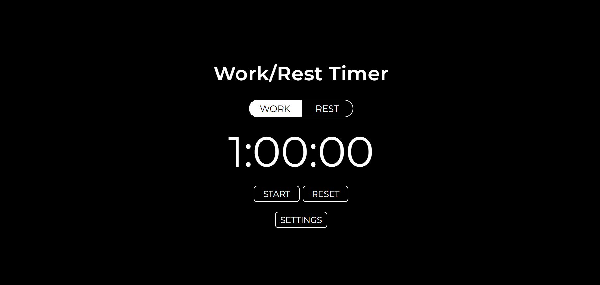

# Work And Rest Timer



Work and Rest Timer is a simple web page that helps you manage your work and rest time with short work sessions. 

The settings mode allows users to set the duration of work and rest periods, enable automatic switching between work and rest periods, set a timer theme, and configure sound notifications at the end of each session, including sound duration and volume.

Click on the link to view the [DEMO](https://ivansdk.github.io/work-and-rest_timer/).

## Features

- **Work and Rest Timer**: Easily switch between work and rest periods with the "Work" and "Rest" buttons, allowing you to follow a structured work-rest schedule.

- **Timer Controls**: Start and stop the timer with the "Start" and "Stop" buttons, respectively. The "Start" button changes to "Stop" when the timer is running, providing intuitive control over the timer.

- **Timer Reset**: Use the "Reset" button to reset the timer and start from the initial duration.

- **Settings Configuration**: Customize the timer settings through the "Settings" button, which opens a modal window. Adjust the duration of work and rest periods according to your preference.

- **Automatic Timer Switching**: Enable automatic switching between work and rest periods. Once a session ends, the timer will automatically transition to the next phase, helping you maintain a productive work-rest cycle.

- **Theme Customization**: Personalize the timer's appearance by selecting a theme from the settings. Choose a theme that suits your visual preferences and creates a pleasant working environment.

- **Sound Notifications**: Enable sound notifications to alert you when a work or rest session ends. Adjust the duration and volume of the sound notifications to ensure they are suitable for your needs.

## Usage

1. Clone the repository:

   ```
   git clone https://github.com/ivansdk/work-and-rest_timer.git
   ```

2. Open `index.html` in your preferred web browser.

3. Click the "Work" or "Rest" button to switch between work and rest periods.

4. The timer display will show the remaining time for the current session.

5. Click the "Start" button to begin the timer. The label will change to "Stop."

6. Click the "Stop" button to pause the timer. The label will revert to "Start."

7. Use the "Reset" button to reset the timer.

8. Click the "Settings" button to open the modal window and customize the timer settings.

## Technologies Used

- HTML
- SASS
- JavaScript

## License

This project is licensed under the [MIT License](LICENSE.md). Feel free to use and modify it for educational purposes.

**Note:** Please be aware that the performance of certain code segments within the project may be affected by browser resource limitations
